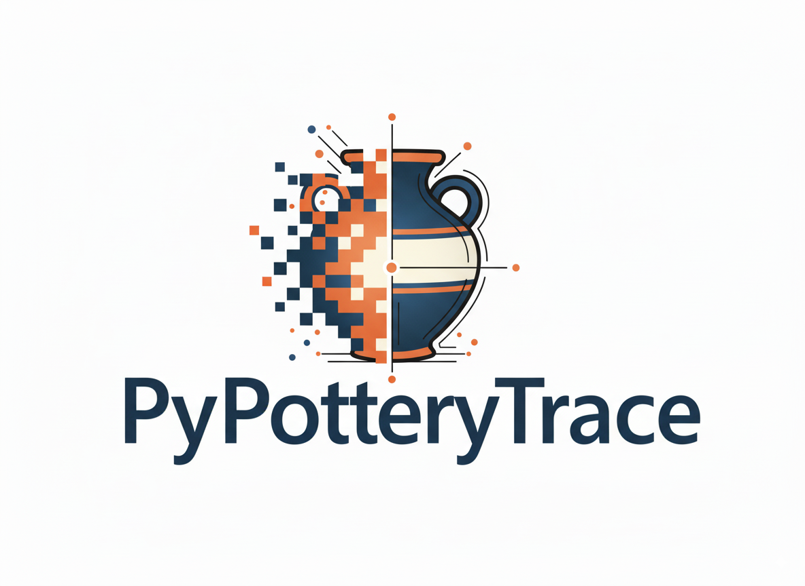

<div align="center">

# PyPotteryTrace



A Python tool to convert archaeological pottery drawings into clean vector graphics.

[](https://www.python.org/)  
[](LICENSE)  
[](#roadmap)  
[](archaeological_vectorizer_gui.py)

</div>

PyPotteryTrace turns archaeological pottery drawings into clean, structured SVG vectors. It distinguishes between different graphical elements (lines, dotted points, painted decorations), simplifies and smooths them with Bézier curves, and produces publication/modifiable‑ready vector output plus diagnostic imagery.


---

## ✨ Key Features

### Core Engine
* Sensitive binarization with adjustable shadow sensitivity
* Connected component analysis for dotted point detection (area + circularity filtering)
* Detection of painted (filled) decorative areas via darkness + area thresholds
* Line skeletonization (scikit-image) restricted to cleaned line layers
* Graph reconstruction (via `sknw`) and endpoint connection heuristics
* Path simplification (RDP algorithm) with adjustable epsilon
* Optional Bézier curve smoothing for natural line appearance
* Element classification: lines, dotted points, painted decorations
* SVG generation (with optional embedded faded background image)
* Automatic comparison JPG: original vs. vector overlay
* Rich debug visualizations (skeleton, classification layers, etc.)

### GUI (CustomTkinter)
* Light/Dark theme toggle
* Organized tabs: Basic, Advanced, Presets
* Preset parameter profiles (Default, High Detail, Smooth Curves, Quick, Decorations Focus, Line Drawings)
* Batch mode (process all supported images in a folder)
* Progress bar + detailed logging pane
* Automatic output path generation & open‑file shortcuts
* Optional background embedding + debug image saving

### Outputs
* `*_vectorized.svg` – Final structured vector drawing
* `*_comparison.jpg` – Side‑by‑side overlay composite
* Per‑image report (`*_report.txt`) – Parameters, stats, timings
* Batch summary (`batch_summary.txt`) – Aggregated results
* Optional debug images (`skeleton_debug.png`, `diagnostic_plots.png`)

---

## 🧱 Architecture Overview

1. Load & normalize input image
2. Binarize to detect line/shadow regions
3. Separate element candidates: dotted points, painted areas, linear strokes
4. Skeletonize line layer → graph model (`sknw`)
5. Connect nearby endpoints (heuristic bridging) for continuity
6. Extract paths → simplify (RDP) → optionally smooth (quadratic/cubic Bézier generation)
7. Classify elements & compute statistics (lengths, counts, areas)
8. Render SVG layers (grouped styles) + JPG comparison + reports

---

## 📦 Installation

### 0. Executable

**Stay tuned!**

### 1. Clone
```bash
git clone https://github.com/your-user/PyPotteryTrace.git
cd PyPotteryTrace
```

### 2. Create & Activate Virtual Environment (Recommended)
```bash
python -m venv .venv
source .venv/bin/activate  # macOS/Linux
# or on Windows
.venv\Scripts\activate
```

### 3. Install Dependencies
Install manually:
```bash
pip install -r "requirements.txt"
```

---

## 🚀 Quick Start

### Run the GUI
```bash
python archaeological_vectorizer_gui.py

1. Click Browse to select an input image (JPG, PNG, TIFF, BMP)
2. (Optional) Toggle batch mode and choose an input folder
3. Choose / adjust a preset
4. Press Start Vectorization
5. Open generated SVG / comparison via interface buttons

### Use the Core API
```python
from archaeological_vectorizer import vectorize_archaeological_drawing

result = vectorize_archaeological_drawing(
	image_path="data/prova.jpg",
	output_svg_path="data_vectorized/prova.svg",
	output_jpg_path="data_vectorized/prova_comparison.jpg",
	binary_threshold=15,
	epsilon=1.5,
	smoothing_factor=0.3,
	min_dotted_area=5,
	max_dotted_area=200,
	dotted_circularity=0.6,
	dark_threshold=100,
	min_decoration_area=1000,
	show_debug_plots=False,
	save_debug_images=True,
	include_background_image=False,
)

print(result.keys())  # stats & internal structures
```

---

## ⚙️ Core Parameters (Selected)

| Name | Purpose | Typical Range |
|------|---------|---------------|
| `binary_threshold` | Shadow / line sensitivity | 5–50 |
| `epsilon` | Path simplification (RDP) tolerance | 0.5–10.0 |
| `smoothing_factor` | Bézier curve smoothing intensity | 0.0–1.0 |
| `min_dotted_area` / `max_dotted_area` | Size limits for dotted points | 3–300 |
| `dotted_circularity` | Circularity threshold (1 = perfect) | 0.4–0.9 |
| `dark_threshold` | Greyscale threshold for painted areas | 80–150 |
| `min_decoration_area` | Minimum area for painted region | 500–5000 |
| `include_background_image` | Embed original raster in SVG (30% opacity) | Boolean |
| `show_debug_plots` | Display matplotlib windows | Boolean |
| `save_debug_images` | Write debug composite images | Boolean |

Presets in the GUI adjust these coherently for different use cases (detail emphasis vs. speed vs. decoration detection).

---

## 🗂️ Batch Mode

1. Check the Batch Mode toggle
2. Select an input folder & (optionally) output folder
3. All supported images inside are processed sequentially
4. A `batch_summary.txt` file aggregates: processed count, failures, per‑file stats

---

## 🧪 Outputs Explained

| File | Description |
|------|-------------|
| `*_vectorized.svg` | Layered paths (lines, dotted points, decorations); optional background group |
| `*_comparison.jpg` | Raster overlay (original vs. vector) for QA |
| `*_report.txt` | Per‑image parameter snapshot + derived metrics |
| `batch_summary.txt` | Summary across batch run |
| `skeleton_debug.png` | Colorized classification overlay (if enabled) |
| `diagnostic_plots.png` | Multi‑panel process visualization (if enabled) |

---

## 🧭 Roadmap

Planned / aspirational improvements:

* [ ] Executable packaging (PyInstaller / similar)
* [ ] In‑GUI preview of vector overlay before export

Contributions & issue reports welcome (see below).

---

## 🤝 Contributing

1. Fork repository
2. Create feature branch: `git checkout -b feature/my-improvement`
3. Commit changes with clear messages
4. Open a Pull Request describing motivation & test evidence

Guidelines:
* Keep functions small & documented
* Avoid adding heavy dependencies without discussion
* If changing algorithms, include before/after examples

---


## 📨 Contact / Support

Open an Issue for bugs, feature requests, or questions and include:

* Input image characteristics (dimensions, format)
* Parameters used (copy from report file if available)
* Expected vs. observed behavior

Open an Issue also for general questions or usage help or feature requests.

---

<div align="center">
Happy vectorizing! 🏺
</div>

## 👥 Contributors

<a href="https://github.com/lrncrd/PyPotteryTrace/graphs/contributors">
  
</a>
