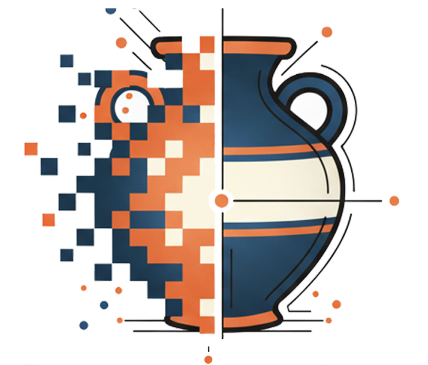

<div align="center">

# PyPotteryTrace



Interactive AI-powered tool for archaeological pottery drawing vectorization.

[](https://www.python.org/)  
[](LICENSE)  
[](#roadmap)  
[](https://flask.palletsprojects.com/)  
[](https://github.com/facebookresearch/segment-anything-2)

</div>

PyPotteryTrace is a web-based interactive tool for converting archaeological pottery drawings into clean, structured SVG vectors. Using Meta's SAM2 (Segment Anything Model 2) for AI-powered segmentation, it allows archaeologists to precisely segment pottery elements, assign archaeological categories, and generate publication-ready vector graphics with automatic mirroring and intelligent profile connections.

---

## 🎯 What is PyPotteryTrace?

PyPotteryTrace is a **web-based Flask application** that combines AI-powered segmentation (SAM2) with specialized vectorization algorithms to convert archaeological pottery drawings into structured SVG files. Unlike generic vectorization tools, PyPotteryTrace understands archaeological pottery conventions and automates tasks like:

- **Profile mirroring** around a rotation axis (with automatic construction lines)
- **Running element connection** to profiles with asymmetric logic
- **Category-based organization** of SVG layers
- **Outer contour extraction** for profiles and running elements
- **Project management** for iterative work on complex drawings

### Key Workflow
1. **Upload** pottery drawing image
2. **Segment** elements using AI (click-based prompts)
3. **Categorize** elements (Profile, Running_Element, Decoration, etc.)
4. **Define rotation center** for automatic mirroring
5. **Vectorize** with intelligent category-specific processing
6. **Export** organized SVG with proper layer structure

---

## ✨ Key Features

### 🤖 AI-Powered Segmentation (SAM2)
* **Point prompts**: Click to add/remove areas from segmentation
* **Real-time feedback**: Instant visual segmentation updates
* **Precise boundaries**: AI-detected element edges with sub-pixel accuracy
* **Multiple elements**: Segment multiple pottery elements independently

### 🏺 Archaeological Category System
Specialized categories matching archaeological drawing conventions:

| Category | Description | Vectorization | Mirroring |
|----------|-------------|---------------|-----------|
| **Profile** | Vessel profile/outline | Outer contour + construction lines (Symmetry_Line, Diameter) | ✅ Auto-mirror |
| **Running_Element** | Ridges, grooves, bands | Outer contour (open path) | ✅ Auto-mirror |
| **Prospectus** | Front/rear view | Standard vectorization | ❌ No mirror |
| **Application** | Applied elements | Standard vectorization | ❌ No mirror |
| **Handle** | Handles, spouts | Standard vectorization | ❌ No mirror |
| **Decoration** | Surface decoration | Standard vectorization | ❌ No mirror |
| **Detail** | Additional details | Standard vectorization | ❌ No mirror |

### 🔄 Smart Mirroring & Connection
* **Automatic profile mirroring** around user-defined rotation center
* **Asymmetric connection logic** for Running_Element ↔ Profile:
  - **Right side** (original): Running_Element extends to touch Profile (elements stay separate)
  - **Left side** (mirrored): Profile_Mirrored merges with Running_Element_Mirrored (unified curve)
* **Construction lines** automatically generated for Profile (Symmetry_Line, Diameter)
* **No construction lines** for Running_Element (cleaner output)

### 📐 Advanced Vectorization Engine
* **Contour extraction** from binary masks
* **Douglas-Peucker (RDP) simplification** for cleaner paths
* **Bézier curve smoothing** for natural line appearance
* **Open vs closed paths** based on category logic
* **Distance-based merging** for profile fusion (proximity threshold)
* **Endpoint extension** for visual element connection

### 🗂️ Project Management
* **Session persistence**: Save/load complete project state
* **Organized workspace**: Automatic folder structure (masks, originals, outputs)
* **Version control**: Iterate on complex drawings without data loss
* **Batch processing**: Vectorize multiple elements in one pass

### 📦 Export Options
* **Organized SVG**: Category-grouped layers with proper z-ordering
* **COCO format**: ML-compatible annotations (bounding boxes, polygons)
* **Individual masks**: PNG masks for each segmented element
* **Project archive**: Complete workspace for collaboration

---

## 🧱 Technical Architecture

### Stack Overview
```
Frontend:  HTML5 Canvas + Vanilla JavaScript (ES6 modules)
Backend:   Flask (Python 3.9+)
AI Model:  SAM2 (Segment Anything Model 2) via PyTorch
Image:     OpenCV + NumPy + Pillow + scikit-image
Vector:    svgwrite + rdp (Douglas-Peucker) + Bézier smoothing
Storage:   File-based project structure + JSON metadata
```

### Backend Architecture (`interactive_app/`)

```
main.py                     # Flask app, routes, orchestration
├── sam2_handler.py         # SAM2 model loading & segmentation
├── vectorization_handler.py # Mask→SVG conversion, mirroring, merging
├── project_manager.py      # Project state persistence
├── ml_export_handler.py    # COCO format export
└── config_template.py      # Configuration defaults
```

**Key Modules:**
- **`main.py`**: Flask routes (`/upload`, `/segment`, `/vectorize`, `/save_project`), session management
- **`sam2_handler.py`**: Loads SAM2 model, processes point/box prompts, returns segmentation masks
- **`vectorization_handler.py`**: 
  - Extracts contours from masks
  - Creates SVG paths with RDP simplification
  - Handles mirroring logic (Profile + Running_Element)
  - Implements asymmetric connection (`extend_running_element_to_profile`, `merge_profile_with_running_element`)
- **`project_manager.py`**: Saves/loads project state JSON, manages file structure
- **`ml_export_handler.py`**: Converts masks to COCO annotation format

### Frontend Architecture (`interactive_app/static/js/`)

```
app.js                 # Main application controller
├── modules/
│   ├── canvasManager.js       # Canvas rendering, zoom/pan
│   ├── imageGrid.js           # Thumbnail grid for elements
│   ├── segmentation.js        # SAM2 interaction (prompts)
│   ├── projectManager.js      # Save/load UI
│   └── postprocess.js         # Batch export, stroke widths
```

**Workflow:**
1. User uploads image → `canvasManager` displays on canvas
2. User clicks → `segmentation` sends prompts to `/segment` endpoint
3. SAM2 returns mask → rendered as overlay on canvas
4. User assigns category → stored in element metadata
5. "Vectorize All" → `/vectorize` processes all elements
6. Backend generates SVG → returned to frontend for download

### Vectorization Pipeline

```
1. Mask (PNG binary image)
   ↓
2. cv2.findContours() → extract boundary points
   ↓
3. Filter contours (largest = outer contour)
   ↓
4. rdp() simplification (epsilon tolerance)
   ↓
5. smooth_path_to_bezier() [optional]
   ↓
6. Create SVG path element with category styling
   ↓
7. Mirror if Profile or Running_Element
   ↓
8. Apply connection logic (extend/merge)
   ↓
9. Export organized SVG with grouped layers
```

### Mirroring & Connection Logic

**Profile Category:**
1. Extract outer contour from mask
2. Create Symmetry_Line (vertical through rotation center)
3. Create Diameter line (horizontal at max width)
4. Mirror outer contour around rotation center → Profile_Mirrored
5. Group in SVG: Profile, Symmetry_Line, Diameter

**Running_Element Category:**
1. Extract outer contour (open path, no closing)
2. If Profile exists: extend endpoints to touch Profile
3. Mirror outer contour → Running_Element_Mirrored
4. Right side: Keep extended Running_Element separate
5. Left side: Merge Profile_Mirrored + Running_Element_Mirrored using distance matrix
6. Remove Running_Element_Mirrored after merge (unified curve)

---

## 📦 Installation

### Prerequisites
- **Python 3.9+** (3.10 or 3.11 recommended)
- **CUDA-capable GPU** (recommended for SAM2, but CPU works)
- **Git** for cloning and SAM2 installation

### Step 1: Clone Repository
```bash
git clone https://github.com/lrncrd/PyPotteryTrace.git
cd PyPotteryTrace
```

### Step 2: Create Virtual Environment
```bash
# Windows
python -m venv .venv
.venv\Scripts\activate

# macOS/Linux
python3 -m venv .venv
source .venv/bin/activate
```

### Step 3: Install Dependencies
```bash
# Install PyTorch (adjust for your CUDA version if needed)
# Visit https://pytorch.org for specific commands

# CUDA 11.8 example:
pip install torch torchvision --index-url https://download.pytorch.org/whl/cu118

# CPU only:
pip install torch torchvision

# Install SAM2 from GitHub
pip install git+https://github.com/facebookresearch/segment-anything-2.git

# Install remaining requirements
pip install -r requirements.txt
```

### Step 4: Download SAM2 Models
Models are downloaded automatically on first run, but you can pre-download:

```bash
cd interactive_app/models
# Small model (~180MB, faster):
wget https://dl.fbaipublicfiles.com/segment_anything_2/072824/sam2_hiera_small.pt

# Base+ model (~319MB, better quality):
wget https://dl.fbaipublicfiles.com/segment_anything_2/072824/sam2_hiera_base_plus.pt

# Tiny model (~108MB, fastest):
wget https://dl.fbaipublicfiles.com/segment_anything_2/072824/sam2_hiera_tiny.pt
```

### Step 5: Run the Application
```bash
cd interactive_app
python main.py
```

Open browser at: **http://localhost:5000**

---

## 🚀 Quick Start Guide

### 1. Launch Application
```bash
cd interactive_app
python main.py
```
Navigate to **http://localhost:5000** in your browser.

### 2. Upload Image
- Click **"Select Image"** button
- Choose your pottery drawing (JPG, PNG, TIFF, BMP)
- Image appears on canvas

### 3. Segment Elements
- **Click on pottery element** (e.g., profile outline)
- SAM2 generates segmentation mask automatically
- **Refine segmentation** (if needed):
  - Click inside = add area (positive prompt)
  - Right-click = remove area (negative prompt)
- Click **"Confirm Segment"** when satisfied

### 4. Assign Category
- Select category from dropdown (Profile, Running_Element, Decoration, etc.)
- Element appears in thumbnail grid with assigned category
- Repeat steps 3-4 for each element

### 5. Define Rotation Center
- Click **"Set Rotation Center"** button
- Click on canvas where vertical symmetry axis should be
- Center point appears as red circle
- Required for Profile and Running_Element mirroring

### 6. Adjust Settings (Optional)
- Set **stroke widths** for each category
- Configure vectorization parameters (epsilon, smoothing)

### 7. Vectorize
- Click **"Vectorize All"** button
- Backend processes all elements with category-specific logic
- Progress bar shows completion

### 8. Download & Save
- **Download SVG**: Get organized vector file
- **Save Project**: Store complete session (masks, state, settings)
- **Load Project**: Resume work on saved project

### Example Workflow: Profile + Running_Element

```
1. Upload pottery drawing with profile and ridge
2. Segment profile outline → Assign "Profile" category
3. Segment ridge/band → Assign "Running_Element" category
4. Set rotation center on vertical axis
5. Vectorize All
   → Profile generates: Profile, Profile_Mirrored, Symmetry_Line, Diameter
   → Running_Element generates: Running_Element extended to Profile (right)
   → Left side: Profile_Mirrored merges with Running_Element_Mirrored
6. Download organized SVG with proper layers
```

---

## ⚙️ Configuration & Parameters

### Vectorization Parameters

Adjust in the web interface or via `config_template.py`:

| Parameter | Description | Default | Range |
|-----------|-------------|---------|-------|
| `epsilon` | RDP simplification tolerance (higher = simpler paths) | 2.0 | 0.5-10.0 |
| `smoothing_factor` | Bézier curve smoothing intensity | 0.3 | 0.0-1.0 |
| `min_contour_points` | Minimum points to keep a contour | 10 | 5-50 |
| `proximity_threshold` | Distance (px) for profile merging | 50.0 | 10-200 |

### Stroke Widths (SVG Export)

Default stroke widths by category (adjustable in UI):

| Category | Default Width | Adjustable |
|----------|---------------|------------|
| Profile | 1.5 pt | ✅ |
| Profile_Mirrored | 1.5 pt | ✅ |
| Symmetry_Line | 0.5 pt | ✅ |
| Diameter | 0.8 pt | ✅ |
| Running_Element | 1.2 pt | ✅ |
| Application | 1.2 pt | ✅ |
| Handle | 1.0 pt | ✅ |
| Decoration | 0.8 pt | ✅ |
| Detail | 0.6 pt | ✅ |

### SAM2 Model Selection

Choose model size in `sam2_handler.py`:

| Model | Size | Speed | Quality | Use Case |
|-------|------|-------|---------|----------|
| `tiny` | ~108MB | Fastest | Good | Quick testing |
| `small` | ~180MB | Fast | Better | **Default (recommended)** |
| `base_plus` | ~319MB | Slower | Best | High-precision work |

---

## 📂 Project Structure & Outputs

### Project Folder Structure

When you save a project, PyPotteryTrace creates an organized folder:

```
projects/
└── PROJECTNAME_YYYYMMDD_HHMMSS/
    ├── project_state.json          # Complete project metadata
    ├── project_vectorized.svg       # Final organized SVG output
    ├── COCO_annotations.json        # ML export format
    ├── original/
    │   └── input_image.jpg          # Original uploaded image
    └── masks/
        ├── Profile_1.png            # Individual element masks
        ├── Running_Element_1.png
        ├── Decoration_1.png
        └── ...
```

### Output Files Explained

#### `project_vectorized.svg`
Organized SVG with category-based groups:

```xml
<svg>
  <g id="Profile">
    <path d="M..." />                    <!-- Profile outer contour -->
  </g>
  <g id="Symmetry_Line">
    <path d="M..." />                    <!-- Vertical construction line -->
  </g>
  <g id="Diameter">
    <path d="M..." />                    <!-- Horizontal construction line -->
  </g>
  <g id="Profile_Mirrored">
    <path d="M..." />                    <!-- Mirrored profile (merged with Running_Element_Mirrored) -->
  </g>
  <g id="Running_Element">
    <path d="M..." />                    <!-- Running element (extended to Profile) -->
  </g>
  <!-- Running_Element_Mirrored removed after merge -->
  <g id="Decoration">
    <path d="M..." />
  </g>
</svg>
```

**Key Features:**
- **Organized layers**: Easy to manipulate in Illustrator/Inkscape
- **Construction lines**: Separate groups for Symmetry_Line and Diameter
- **Merged profiles**: Left side shows unified Profile_Mirrored
- **Stroke styling**: Category-specific widths and colors

#### `project_state.json`
Complete project state for resuming work:

```json
{
  "project_id": "PROJECTNAME_20251111_123456",
  "created_at": "2025-11-11T12:34:56",
  "image": {
    "filename": "pottery_drawing.jpg",
    "width": 2000,
    "height": 1500
  },
  "rotation_center": {"x": 500, "y": 750},
  "elements": [
    {
      "id": "elem_001",
      "category": "Profile",
      "mask_path": "masks/Profile_1.png",
      "vectorized": true,
      "vectorization_params": {...}
    },
    ...
  ]
}
```

#### `COCO_annotations.json`
Machine learning compatible format:

```json
{
  "images": [...],
  "annotations": [
    {
      "id": 1,
      "image_id": 1,
      "category_id": 1,
      "segmentation": [[x1,y1,x2,y2,...]],
      "bbox": [x, y, width, height],
      "area": 12345
    },
    ...
  ],
  "categories": [
    {"id": 1, "name": "Profile"},
    {"id": 2, "name": "Running_Element"},
    ...
  ]
}
```

---

## 🔧 Advanced Usage

### API Endpoints (Flask Backend)

The Flask application exposes several REST endpoints:

#### `POST /upload`
Upload image and create new session.

**Request:**
```javascript
FormData: {
  image: File (JPG, PNG, TIFF, BMP)
}
```

**Response:**
```json
{
  "success": true,
  "session_id": "abc123...",
  "image_path": "/uploads/abc123/original.jpg",
  "dimensions": {"width": 2000, "height": 1500}
}
```

#### `POST /segment`
Generate segmentation mask using SAM2.

**Request:**
```json
{
  "session_id": "abc123...",
  "prompts": [
    {"type": "point", "x": 500, "y": 300, "label": 1},  // positive
    {"type": "point", "x": 520, "y": 310, "label": 0}   // negative
  ]
}
```

**Response:**
```json
{
  "success": true,
  "mask": "data:image/png;base64,iVBORw0KGg...",
  "mask_path": "/uploads/abc123/temp_mask.png"
}
```

#### `POST /vectorize`
Vectorize single element or all elements.

**Request:**
```json
{
  "session_id": "abc123...",
  "element_id": "elem_001",  // optional, omit for batch
  "category": "Profile",
  "rotation_center": {"x": 500, "y": 750},
  "params": {
    "epsilon": 2.0,
    "smoothing_factor": 0.3
  }
}
```

**Response:**
```json
{
  "success": true,
  "svg_path": "/uploads/abc123/project_vectorized.svg",
  "elements_processed": 5
}
```

#### `POST /save_project`
Save complete project state.

**Request:**
```json
{
  "session_id": "abc123...",
  "project_name": "MyPottery"
}
```

**Response:**
```json
{
  "success": true,
  "project_path": "/projects/MyPottery_20251111_123456",
  "project_id": "MyPottery_20251111_123456"
}
```

### Programmatic Usage (Python)

You can use the vectorization engine programmatically:

```python
from interactive_app.vectorization_handler import VectorizationHandler
import numpy as np

# Initialize handler
handler = VectorizationHandler()

# Vectorize a mask
mask = cv2.imread('mask.png', cv2.IMREAD_GRAYSCALE)
svg_path = handler.vectorize_from_png(
    mask_path='mask.png',
    output_path='output.svg',
    category='Profile',
    epsilon=2.0,
    smoothing_factor=0.3
)

# Create mirrored profile
rotation_center_x = 500
handler.create_profile_svg(
    outer_contour=contour_points,
    output_path='profile.svg',
    center_x=rotation_center_x,
    image_height=1000
)
```

### Custom Categories

To add custom categories, edit `vectorization_handler.py`:

```python
CATEGORIES = {
    'YourCategory': {
        'color': '#FF5733',
        'stroke_width': 1.0,
        'fill': 'none',
        'description': 'Your custom category'
    }
}
```

Then update `interactive_app/templates/index.html` category dropdown.

---

## 🧭 Roadmap

### ✅ Completed Features (v0.1)
- [x] Flask web application with responsive UI
- [x] SAM2 integration for AI-powered segmentation
- [x] Archaeological category system (7 categories)
- [x] Automatic profile mirroring with construction lines
- [x] Running_Element category with asymmetric connection logic
- [x] Project management (save/load sessions)
- [x] Organized SVG export with layer structure
- [x] COCO format export for ML workflows
- [x] Distance-based profile merging algorithm
- [x] Endpoint extension for visual element connection

### 🚧 In Progress
- [ ] Enhanced Bézier smoothing for curved decorations
- [ ] Batch processing multiple images in one session
- [ ] Undo/redo functionality for segmentation prompts

### 📋 Planned Features
- [ ] Box prompts for SAM2 (in addition to point prompts)
- [ ] Custom category creation via UI
- [ ] SVG layer visibility toggle in preview
- [ ] Export to DXF format (CAD compatibility)
- [ ] Decoration pattern recognition algorithms
- [ ] Multi-profile support (multiple vessels in one image)
- [ ] Collaborative editing (multi-user sessions)
- [ ] Docker containerization for easy deployment
- [ ] Electron desktop app (offline usage)

### 🔬 Research Directions
- [ ] Automatic rotation center detection (AI-based)
- [ ] Style transfer for consistent line weights
- [ ] 3D profile generation from 2D drawings
- [ ] Integration with archaeological databases

---

## 🤝 Contributing

PyPotteryTrace is open for contributions! Here's how:

1. **Fork repository** on GitHub
2. **Create feature branch**: `git checkout -b feature/your-improvement`
3. **Make changes** with clear, documented code
4. **Test thoroughly** with real pottery drawings
5. **Commit** with descriptive messages
6. **Open Pull Request** with:
   - Clear description of changes
   - Before/after examples (if UI/algorithm changes)
   - Test results

### Contribution Guidelines
* Keep functions small, focused, and well-documented
* Follow existing code style (PEP 8 for Python)
* Avoid adding heavy dependencies without discussion
* Include docstrings for new functions
* Update README if adding user-facing features

### Areas for Contribution
- **Algorithm improvements**: Better path simplification, smoothing
- **UI enhancements**: Accessibility, mobile responsiveness
- **Documentation**: Tutorials, examples, translations
- **Testing**: Unit tests, integration tests
- **Performance**: Optimization for large images

---

## 📨 Contact & Support

### Reporting Issues
Open an [Issue](https://github.com/lrncrd/PyPotteryTrace/issues) and include:
- **Input image** characteristics (dimensions, format, DPI)
- **Steps to reproduce** the problem
- **Expected vs. actual** behavior
- **Screenshots/error messages** if applicable
- **Environment**: OS, Python version, browser

### Feature Requests
We welcome feature suggestions! Please:
- Check existing issues to avoid duplicates
- Describe the use case and expected benefit
- Include mockups or examples if possible

### Questions & Discussion
- **Issues tab**: General questions, usage help
- **Discussions**: Ideas, archaeological workflows, best practices

### Acknowledgments
- **SAM2**: Meta AI Research ([segment-anything-2](https://github.com/facebookresearch/segment-anything-2))
- **RDP Algorithm**: Ramer-Douglas-Peucker simplification
- **OpenCV**: Computer vision library
- **Flask**: Lightweight web framework

---

---

## 📄 License

This project is licensed under the **Apache License 2.0** - see the [LICENSE](LICENSE) file for details.

```
Copyright 2025 Lorenzo Cardarelli

Licensed under the Apache License, Version 2.0 (the "License");
you may not use this file except in compliance with the License.
You may obtain a copy of the License at

    http://www.apache.org/licenses/LICENSE-2.0

Unless required by applicable law or agreed to in writing, software
distributed under the License is distributed on an "AS IS" BASIS,
WITHOUT WARRANTIES OR CONDITIONS OF ANY KIND, either express or implied.
See the License for the specific language governing permissions and
limitations under the License.
```

---

<div align="center">

## 👥 Contributors

<a href="https://github.com/lrncrd/PyPotteryTrace/graphs/contributors">
  
</a>

---

**Happy vectorizing!** 🏺✨

*Built with ❤️ for the archaeological community*

</div>
